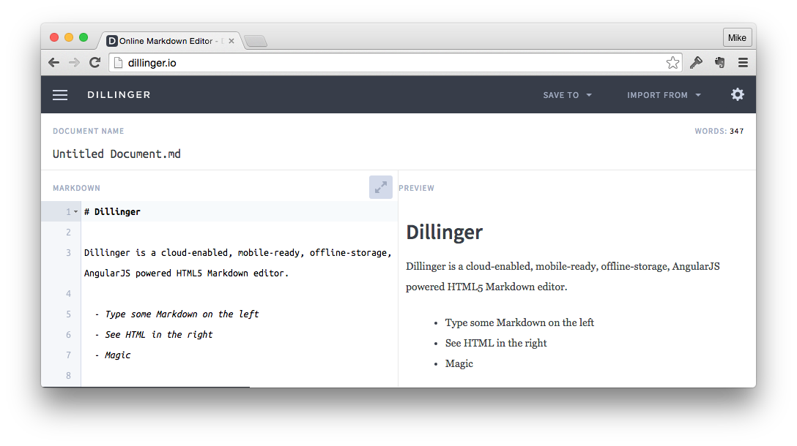
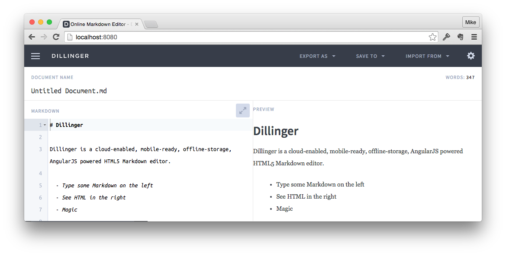

## dillinger
Use dillinger to run your own [github flavored markdown](https://help.github.com/articles/github-flavored-markdown/) editor-web-server on your mac under OS-X.

There is a [public dillenger server at is dillinger.io](http://dillinger.io), but it can be too slow to be useful.

.

### Installation

I installed my own local dillinger server on OS X Yosemite 10.10.5 following the instructions at https://github.com/joemccann/dillinger

First I installed [homebrew](http://brew.sh/).

````
ruby -e "$(curl -fsSL https://raw.githubusercontent.com/Homebrew/install/master/install)"
````

Then i installed [npm](https://www.npmjs.com/).
````
brew install npm
````

````
cd ~/Documents
mkdir tryDillinger
cd tryDillinger
````

Then from following the instructions from https://github.com/joemccann/dillinger

````
npm i -g gulp
````

````
git clone git@github.com:joemccann/dillinger
cd dillinger
npm i -d
mkdir -p downloads/files/{md,html,pdf}
gulp build --prod
````

Next start your dillinger server:
````
NODE_ENV=production node app
````

Then goto ````http://localhost:8080```` in your favorite browser to start editing.



### Issues

I end up with issues when I try to use the ````export as```` ````->```` ````markdown```` menu option.


````
::1 - POST /factory/fetch_markdown HTTP/1.1 500 22 - 29.606 ms
TypeError: undefined is not a function
    at fetchMd (/Users/mikes/Documents/tryDillinger/dillinger/plugins/core/server.js:38:16)
        at Layer.handle [as handle_request] (/Users/mikes/Documents/tryDillinger/dillinger/node_modules/express/lib/router/layer.js:95:5)
	    at next (/Users/mikes/Documents/tryDillinger/dillinger/node_modules/express/lib/router/route.js:131:13)
	        at Route.dispatch (/Users/mikes/Documents/tryDillinger/dillinger/node_modules/express/lib/router/route.js:112:3)
		    at Layer.handle [as handle_request] (/Users/mikes/Documents/tryDillinger/dillinger/node_modules/express/lib/router/layer.js:95:5)
		        at /Users/mikes/Documents/tryDillinger/dillinger/node_modules/express/lib/router/index.js:277:22
			    at Function.process_params (/Users/mikes/Documents/tryDillinger/dillinger/node_modules/express/lib/router/index.js:330:12)
			        at next (/Users/mikes/Documents/tryDillinger/dillinger/node_modules/express/lib/router/index.js:271:10)
				    at expressInit (/Users/mikes/Documents/tryDillinger/dillinger/node_modules/express/lib/middleware/init.js:33:5)
				        at Layer.handle [as handle_request] (/Users/mikes/Documents/tryDillinger/dillinger/node_modules/express/lib/router/layer.js:95:5)


````

So I typically cut and paste my markdown from the dillinger editor to into a text editor.
